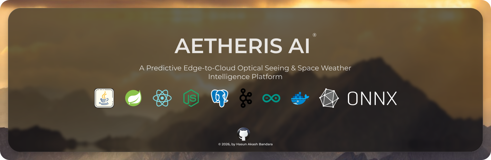
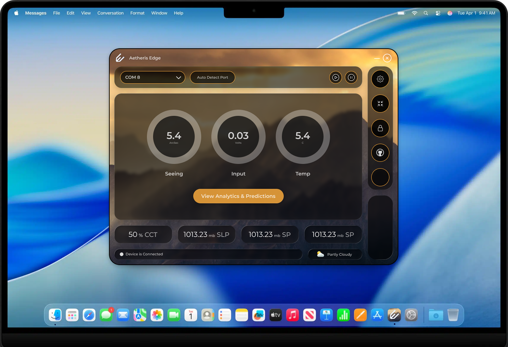

<div align="center">



### Predictive Edge-to-Cloud Optical Seeing & Space Weather Intelligence Platform

<p>
  
  
  
  
  
  
  
  
  
</p>

<p>
  <b>A full-stack, distributed, real-time platform for collecting, streaming, and intelligently analysing optical seeing and space weather telemetry — from an Arduino sensor, through an Apache Kafka event bus, to a React dashboard.</b>
</p>

---

</div>

## 📡 What Is Aetheris AI?

**Aetheris AI** is an enterprise-grade, distributed IoT intelligence platform built for the collection and real-time analysis of **optical atmospheric seeing** and **space weather** data. The system bridges a physical Arduino-based sensor array and a cloud backend, enabling astronomers, observatories, and researchers to monitor ionospheric scintillation, ambient conditions, and hardware health from any browser — in real time.

The platform is designed around three independently deployable modules:

| Module | Technology | Role |
|---|---|---|
| **`aetheris-edge`** | Spring Boot 4 + JavaFX 17 + Apache Kafka | Edge agent — reads Arduino sensor data over USB/Serial, streams to Kafka |
| **`aetheris-ai`** | Spring Boot 4 + Spring Security + WebSocket + PostgreSQL | Cloud backend — consumes Kafka events, persists data, exposes REST & WebSocket APIs |
| **`aetheris-dashboard`** | React 19 + TypeScript 6 + Vite 8 + Recharts | Web frontend — real-time telemetry visualisation, anomaly feed, configurable alerting |

---

## 🏗️ System Architecture

```
┌─────────────────────────────────────────────────────────────────────────┐
│                        HARDWARE LAYER                                   │
│  Arduino Sensor Array ──(USB/Serial · jSerialComm)──▶  aetheris-edge    │
│  Measurements: Seeing (arcsec) · Input Voltage (V) · Temperature (°C)   │
└─────────────────────────────────────────────────────────────────────────┘
                                    │
              Kafka Producer  ·  SensorPayloadDTO  ·  spring-kafka
                                    │
                                    ▼
┌─────────────────────────────────────────────────────────────────────────┐
│                     APACHE KAFKA EVENT BUS                              │
│                      Topic: "sensor-data"                               │
│              (Zookeeper + Kafka Broker on port 9092)                    │
└─────────────────────────────────────────────────────────────────────────┘
                                    │
                    Kafka Consumer  ·  @KafkaListener
                                    │
                                    ▼
┌─────────────────────────────────────────────────────────────────────────┐
│                      CLOUD BACKEND  (aetheris-ai)                       │
│  Spring Boot 4.1 · Spring Security (JWT/Stateless) · Spring WebSocket   │
│  JPA/Hibernate · PostgreSQL 15 · BCrypt · CORS-configured               │
│                                                                         │
│  ┌──────────────────────────────────────────────────────────────────┐   │
│  │                    AI INTELLIGENCE ENGINE                        │   │
│  │  ① LSTM / TFT Forecasting  →  Seeing prediction 5–30 min ahead   │   │
│  │  ② Isolation Forest / Autoencoder  →  Scintillation classifier   │   │
│  │  ③ LLM RAG Agent  →  NL telemetry queries + NOAA/NASA fusion     │   │
│  │     (ONNX Runtime · Vector DB · Function Calling)                │   │
│  └──────────────────────────────────────────────────────────────────┘   │
│                                                                         │
│  Domains:  admin · alerting · forecasting · telemetry                   │
│  Layers:   presentation · application · domain · infrastructure         │
└─────────────────────────────────────────────────────────────────────────┘
                                    │
        WebSocket (STOMP) · REST API (/api/v1/) · LLM Chat Endpoint
                                    │
                                    ▼
┌─────────────────────────────────────────────────────────────────────────┐
│                    WEB FRONTEND  (aetheris-dashboard)                   │
│  React 19 · TypeScript 6 · Vite 8 · TailwindCSS 4 · Framer Motion 13    │
│  Recharts · Axios · React Router v7 · Lucide Icons                      │
│                                                                         │
│  Pages: Home (landing) · Dashboard (live telemetry · anomalies · alerts)│
└─────────────────────────────────────────────────────────────────────────┘
```

---

## ✨ Key Features

### 🛰️ Edge Intelligence — `aetheris-edge`

- **Real-time Arduino Ingestion** — Async serial port connection via `jSerialComm` with `CompletableFuture`-based non-blocking port management and automatic IO buffer flushing
- **Apache Kafka Producer** — Streams structured `SensorPayloadDTO` JSON events to the `sensor-data` topic at 1 Hz using `KafkaTemplate<String, SensorPayloadDTO>`
- **JavaFX Desktop Agent** — Native desktop UI with live gauge display for Seeing (arcsec), Input Voltage (V), and Ambient Temperature (°C)
- **Resilient Reading Thread** — Daemon thread with graceful disconnect detection, stale-byte flushing, and reconnect event signalling via JavaFX `Platform.runLater()`
- **Internet Connectivity Monitoring** — `ConnectivityService` monitors outbound network health of the edge device
- **Open Weather Integration** — `WeatherService` fetches ambient meteorological data to correlate with optical seeing conditions
<br/>
<br/>

<br/>
<br/>

### ☁️ Cloud Backend — `aetheris-ai`

- **Clean Layered Architecture** — Strict separation across `presentation`, `application`, `domain`, and `infrastructure` layers following Domain-Driven Design principles
- **JWT Stateless Authentication** — Spring Security 6 with `jjwt` 0.11.5, BCrypt password hashing, and role-based access control (`ROLE_ADMIN`)
- **Domain-Driven Design** — Bounded contexts for `admin`, `alerting`, `forecasting`, and `telemetry`
- **Admin Lifecycle Management** — Full registration → login → IP capture flow with a `UserStatus` state machine (`PENDING → ACTIVE → BANNED`)
- **WebSocket Real-time Broadcast** — STOMP WebSocket pushes live sensor events from Kafka consumer to all connected dashboard clients
- **PostgreSQL Persistence** — JPA/Hibernate with UUID primary keys, `LocalDateTime` audit fields, and `@Enumerated` status columns
- **Stateless REST API** — Versioned at `/api/v1/` with CORS pre-configured for the Vite dev server

### 📊 Dashboard — `aetheris-dashboard`

- **Live Telemetry Charts** — Real-time Recharts visualisation for Seeing (arcsec), Input Voltage (V), and Ambient Temperature (°C) with configurable critical/warning threshold lines
- **Animated Anomaly Feed** — Framer Motion-powered event log classifying hardware noise spikes, ionospheric scintillation bursts (S4 index), cloud cover events, and system stabilisation
- **Configurable Alerting** — User-adjustable critical/warning thresholds; independent toggles for email and in-dashboard notifications
- **Historical Archive Table** — Session-level event archive with one-click CSV download
- **Protected Routing** — `ProtectedRoute` component with JWT-aware `axios` interceptors for authenticated navigation
- **Particle Background** — Canvas-based animated particle field for a premium observatory aesthetic
- **Dark / Light Mode** — Full theme toggle with React context propagation throughout the layout

---

## 🤖 Intelligence Engine

Aetheris AI is not a passive monitoring tool. Its cloud backend embeds three AI sub-systems that transform raw hardware telemetry into **operational foresight**.

### ① Short-Term Predictive Seeing Engine

> *Replace static threshold alerts with a multi-horizon time-series forecasting model.*

| Attribute | Detail |
|---|---|
| **Models** | LSTM · Temporal Fusion Transformer (TFT) · XGBoost ensemble |
| **Runtime** | ONNX Runtime embedded in Java — zero Python dependency in production |
| **Inputs** | Voltage time-series · Seeing index · Temperature gradient · Solar zenith angle |
| **Horizon** | 5-minute, 15-minute, and 30-minute rolling predictions |
| **Output** | Probabilistic seeing forecast + confidence interval bands on dashboard |
| **Operational Impact** | Allows ground stations to pre-adjust adaptive optics, scale laser transmission power, or reroute satellite downlinks **before** atmospheric fading occurs |

### ② Edge Anomaly Detection & Scintillation Classification

> *Unsupervised ML running directly on the live Kafka data stream.*

| Attribute | Detail |
|---|---|
| **Models** | Isolation Forest · Autoencoder (reconstruction error threshold) |
| **Classification Labels** | `IONOSPHERIC_SCINTILLATION` · `HARDWARE_NOISE_SPIKE` · `CLOUD_ATTENUATION` · `THERMAL_DISTURBANCE` · `WIND_SHAKE` |
| **Key Signal** | Differentiates genuine optical scintillation (S4 index rise) from hardware or environmental noise |
| **Operational Impact** | Eliminates false alarms and ensures clean, standardised data flows into long-term research archives |

### ③ LLM Autonomous Flight Director & RAG Agent

> *Natural language interface fusing logged telemetry with live space weather feeds.*

| Attribute | Detail |
|---|---|
| **Architecture** | Retrieval-Augmented Generation (RAG) with Function Calling |
| **Data Sources** | PostgreSQL telemetry archive · NOAA solar flare feeds · NASA geomagnetic index APIs |
| **Storage** | Vector Database for semantic telemetry search |
| **Example Query** | *"Analyse optical stability during today's 14:00 satellite pass and flag any scintillation anomalies correlated with solar activity."* |
| **Output** | The agent executes DB queries, synthesises space weather data, and generates executive diagnostic reports automatically |

---

## 🔬 Telemetry Intelligence — Hidden Physics in Raw Data

The three hardware channels (Input Voltage, Seeing arcsec, Temperature) are far more than simple gauges. The AI engine extracts the following derived science from them.

### ⚡ From Input Voltage — Raw Solar Intensity Proxy

| Derived Metric | Method | Use Case |
|---|---|---|
| **Cloud Cover & Transparency Transients** | Detect rapid absolute voltage drops unrelated to micro-fluctuations | Classify events as `Cirrus Cloud Passage` or `Heavy Obscuration` rather than bad seeing |
| **Turbulence Frequency Spectrum** | Fast Fourier Transform (FFT) on the high-frequency voltage stream | High-frequency noise → fast high-altitude jet streams; Low-frequency → slow low-altitude thermal mixing |
| **Signal-to-Noise Ratio (SNR)** | `SNR = μ(V) / σ(V)` over a rolling window | Critical metric for optical satellite laser downlinks to determine if a signal can be locked |

### 🔭 From Seeing (arcsec) — Adaptive Optics Parameters

| Derived Metric | Formula | Use Case |
|---|---|---|
| **Fried Parameter (r₀)** | `r₀ = 0.98λ / ε` at λ = 500 nm | Most critical metric for AO systems — represents the telescope diameter over which optical phase distortion ≈ 1 radian. Exposed directly on the dashboard. |
| **Rate of Degradation** | First derivative `d(Seeing)/dt` over 5-minute rolling window | A seeing of 3.0″ with rapid positive trajectory signals an imminent observing window collapse |

### 🌡️ From Temperature — Hardware Calibration

| Derived Metric | Method | Use Case |
|---|---|---|
| **Sensor Thermal Drift Calibration** | Map voltage Δ against temperature Δ | Photodiode dark current and op-amp baseline shift with temperature — backend applies dynamic thermal calibration to remove hardware noise |
| **Dome / Local Seeing Identification** | Cross-reference rapid temperature changes with seeing degradation | Flags bad seeing as `Local Thermal Disturbance` rather than `Ionospheric Scintillation` |

### 🧠 Composite AI Insights — Multi-Variate Analysis

When all three channels are fed together into a time-series model, the AI unlocks:

- **Scintillation Regime Classification** — Groups data into distinct atmospheric states: `Dawn Thermal Mixing` · `Stable Mid-Day` · `High-Altitude Jet Shear` · `Ionospheric Storm`
- **Hardware Anomaly Detection** — If voltage flatlines while temperature spikes, the AI deduces overheating or sensor fault, triggering a **maintenance alert** instead of an atmospheric alert
- **Adaptive Optics Feed** — r₀ values and turbulence spectrum output are exposed as an API endpoint consumable by external deformable mirror control systems

---

## 📋 Requirements

### Functional Requirements (FR)

| ID | Requirement | Status |
|---|---|---|
| FR-01 | **Hardware Telemetry Ingestion** — Edge agent connects to the designated COM port, reads continuous serial data (Input Volts, Seeing, Temperature), and parses it into structured JSON payloads | ✅ Implemented |
| FR-02 | **Real-Time Data Streaming** — Edge agent transmits parsed telemetry to the cloud via Kafka without data loss at ≥ 1 Hz | ✅ Implemented |
| FR-03 | **Predictive Seeing Analysis** — Backend AI engine analyses incoming time-series to generate a seeing forecast 5–30 minutes ahead | 🔄 In Progress |
| FR-04 | **Automated Anomaly Detection** — System evaluates the data stream in real-time to flag irregular spikes and isolate them from genuine ionospheric scintillation | ✅ Implemented |
| FR-05 | **Historical Data Archiving** — Backend persists all raw and processed telemetry into a relational schema optimised for time-series querying | ✅ Implemented |
| FR-06 | **Interactive Dashboard Visualisation** — React frontend renders live telemetry streams, AI predictions, and historical logs using dynamic, low-latency charts | ✅ Implemented |
| FR-07 | **Intelligent Alerting System** — Users configure custom thresholds for current or predicted seeing, triggering automated notifications (email + dashboard UI) | ✅ Implemented |
| FR-08 | **LLM Telemetry Interrogation (RAG)** — Web app provides a natural language chat interface to query historical data and cross-reference it with space weather metrics | 🔄 Planned |

### Non-Functional Requirements (NFR)

| ID | Requirement | Target |
|---|---|---|
| NFR-01 | **System Latency** | End-to-end delay from sensor reading to React visualisation ≤ **500 ms** |
| NFR-02 | **Edge Resilience & Auto-Recovery** | Local Java agent automatically reconnects with **exponential backoff** on COM port disconnect or network drop |
| NFR-03 | **Deployment Portability** | All backend microservices, databases, and AI inference engines fully containerised via **Docker Compose** |
| NFR-04 | **Cross-Platform Compatibility** | Edge agent runs natively on **Windows, macOS, and Linux** via `jSerialComm` — zero OS-specific modifications |
| NFR-05 | **Security & Authentication** | Web dashboard secured via **JWT Bearer tokens** — only authorised personnel can view telemetry or interact with the LLM agent |
| NFR-06 | **Data Integrity & Validation** | Backend API validates all incoming edge payloads, drops malformed packets, and logs errors without interrupting the streaming service |
| NFR-07 | **UI Responsiveness** | Frontend dashboard maintains **≥ 60 FPS** while rendering dense time-series plots — preventing browser freezing or memory leaks |

---

## 🚀 Getting Started

### Prerequisites

| Tool | Minimum Version |
|---|---|
| Java JDK | 21 |
| Maven | 3.9+ |
| Node.js | 20+ |
| Docker Desktop | Any recent |
| Arduino IDE | For sensor firmware flashing |

### 1 — Start Infrastructure (Kafka + PostgreSQL)

```bash
# Start PostgreSQL (project root)
docker compose up -d

# Start Kafka broker (edge module)
cd aetheris-edge/kafka
docker compose up -d
# Kafka UI available at http://localhost:8080
```

### 2 — Run the Cloud Backend

```bash
# From project root
./mvnw spring-boot:run
# REST API: http://localhost:8080/api/v1/
# WebSocket: ws://localhost:8080/ws
```

### 3 — Run the Edge Agent

```bash
cd aetheris-edge
./mvnw spring-boot:run
# A JavaFX window opens — select the Arduino COM port and click Connect
```

### 4 — Run the Dashboard

```bash
cd aetheris-dashboard
npm install
npm run dev
# Dashboard: http://localhost:5173
```

---

## 🔐 Authentication Flow

```
POST /api/v1/auth/register  →  RegisterService → BCrypt hash → PostgreSQL (status: PENDING)
POST /api/v1/auth/login     →  LoginService → JwtService.generateToken() → JWT Bearer token
Authorization: Bearer <token>  →  SecurityFilterChain → JwtFilter → SecurityContext
```

- All routes under `/api/v1/auth/**` are **publicly accessible**
- Every other route requires a valid **JWT Bearer token**
- Sessions are **fully stateless** — no server-side session storage (`SessionCreationPolicy.STATELESS`)
- Accounts blocked with `UserStatus.BANNED` are rejected by Spring Security's `isAccountNonLocked()` hook

---

## 📁 Project Structure

```
aetheris-ai/                                   ← Cloud Backend (Spring Boot WAR)
├── src/main/java/com/ai/aetheris/
│   ├── presentation/controllers/auth/         AuthController.java
│   ├── application/
│   │   ├── services/auth/                     LoginService · RegisterService
│   │   ├── repositories/admin/                AdminRepository
│   │   └── dtos/auth/                         RegisterAdminRequest · LoginRequest
│   ├── domain/
│   │   ├── admin/entities/                    Admin.java  (implements UserDetails)
│   │   ├── shared/enums/                      UserStatus  (PENDING · ACTIVE · BANNED)
│   │   ├── alerting/                          ← in progress
│   │   ├── forecasting/                       ← in progress
│   │   └── telemetry/                         ← in progress
│   └── infrastructure/
│       ├── security/                          JwtService.java
│       └── config/                            SecurityConfig.java
├── docker-compose.yml                         PostgreSQL 15 (port 5432)
└── pom.xml                                    Spring Boot 4.1 · Java 21

aetheris-edge/                                 ← Edge Agent (Spring Boot + JavaFX)
├── src/main/java/com/agent/aetheris/
│   ├── AetherisEdgeFxApplication.java         JavaFX + Spring bootstrap
│   ├── application/service/
│   │   ├── home/                              ArduinoConnectionService · DataReadingThreadService
│   │   ├── internet/                          ConnectivityService
│   │   └── weather/                           WeatherService
│   ├── infrastructure/config/                 KafkaProducerConfig
│   └── presentation/controller/              HomeController (FXML JavaFX)
├── kafka/docker-compose.yml                   Zookeeper + Kafka + Kafka UI
└── pom.xml                                    Kafka · JavaFX · jSerialComm · Jackson

aetheris-dashboard/                            ← React Frontend (Vite + TypeScript)
├── src/
│   ├── pages/                                 home.tsx · dashboard.tsx · auth/
│   ├── components/                            TelemetryChart · ParticleBackground · Toast · ProtectedRoute
│   ├── layouts/                               AppLayout (dark/light mode context)
│   └── api/                                   axios clients with JWT interceptors
└── package.json                               React 19 · TS 6 · Vite 8 · TailwindCSS 4
```

---

## 🛠️ Tech Stack

### Backend — `aetheris-ai`

| Concern | Technology |
|---|---|
| Framework | Spring Boot 4.1.0 (WAR packaging, Tomcat provided) |
| Security | Spring Security 6, JJWT 0.11.5, BCrypt |
| Persistence | Spring Data JPA, Hibernate, PostgreSQL 15 |
| Real-time | Spring WebSocket (STOMP) |
| Language | Java 21 (LTS), Lombok |

### Edge Agent — `aetheris-edge`

| Concern | Technology |
|---|---|
| Framework | Spring Boot 4.1.0 |
| Desktop UI | JavaFX 17 (controls · fxml · media) |
| Serial I/O | jSerialComm 2.10.3 |
| Event Streaming | Apache Kafka · spring-kafka 4.1.0 |
| Serialisation | Jackson Databind |

### Frontend — `aetheris-dashboard`

| Concern | Technology |
|---|---|
| Framework | React 19, TypeScript 6 |
| Build Tool | Vite 8 |
| Styling | TailwindCSS 4 |
| Animation | Framer Motion 13 |
| Charts | Recharts 3 |
| Routing | React Router v7 |
| Icons | Lucide React |
| HTTP Client | Axios |

---

## 🗺️ Roadmap

#### ✅ Completed
- [x] Arduino-to-Kafka edge data pipeline with JavaFX desktop agent
- [x] JWT-secured Spring Boot REST API with stateless session management
- [x] Real-time React dashboard with live telemetry charts and dual thresholds
- [x] Anomaly classification feed (hardware noise · ionospheric · cloud · environmental)
- [x] Admin registration, login, and `UserStatus` lifecycle management
- [x] Particle background, dark/light mode, protected routing

#### 🔄 In Progress
- [ ] Kafka consumer → WebSocket STOMP bridge in cloud backend (FR-02 completion)
- [ ] LSTM / TFT predictive seeing forecasting engine via ONNX Runtime (FR-03)
- [ ] Isolation Forest edge anomaly classification model (FR-04 upgrade)
- [ ] r₀ (Fried Parameter) computation and AO API endpoint

#### 📅 Planned
- [ ] LLM RAG Agent with NOAA/NASA space weather data fusion (FR-08)
- [ ] FFT turbulence frequency spectrum analysis on voltage stream
- [ ] SNR dashboard metric for optical satellite laser downlink assessment
- [ ] Automated email alerting via Spring Mail on threshold breach (FR-07 upgrade)
- [ ] Exponential backoff auto-reconnect in edge agent (NFR-02)
- [ ] Multi-observatory multi-tenant architecture
- [ ] Grafana + InfluxDB metrics integration
- [ ] Mobile-responsive progressive web app (PWA)

---

## 🤝 Contributing

Contributions, issues, and feature requests are welcome!

1. **Fork** the repository
2. **Create** a feature branch — `git checkout -b feature/your-feature`
3. **Commit** your changes — `git commit -m 'feat: describe your change'`
4. **Push** to the branch — `git push origin feature/your-feature`
5. **Open** a Pull Request

Please review [SECURITY.md](./SECURITY.md) before reporting any vulnerabilities.

---

## 📄 License

This project is licensed under the **MIT License** — see the [LICENSE](./LICENSE) file for details.

---

<div align="center">

Built with ☕ Java 21, ⚛️ React 19, and 🛰️ a genuine passion for space weather science.

**⭐ Star this repo if you find it interesting!**

</div>
