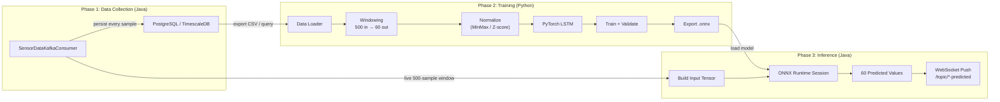
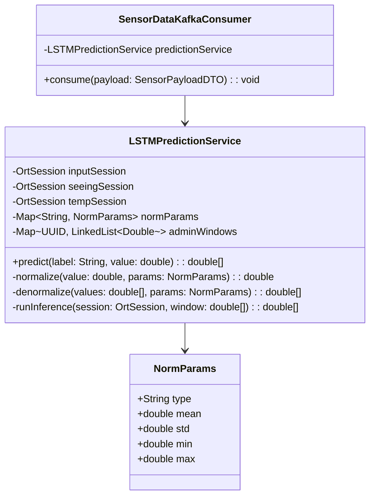
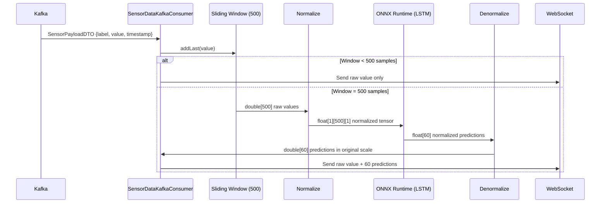

# LSTM-Based Sensor Prediction Guide

## Goal
Use the **last 500 samples** to **predict the next 60 samples** for all three sensor streams (`Input`, `Seeing`, `Temp`) using an LSTM model trained in Python, exported to ONNX, and served via ONNX Runtime inside your Java Spring Boot application.

---

## End-to-End Architecture



---

## Phase 1: Data Collection

Before you can train an LSTM, you need historical data. Your current services only keep a sliding window in memory — you need to **persist every sample**.

### What to Store

| Column | Type | Source |
|--------|------|--------|
| `id` | UUID | auto-generated |
| `label` | VARCHAR | `payload.getLabel()` — `"Input"`, `"Seeing"`, or `"Temp"` |
| `value` | DOUBLE | `payload.getValue()` |
| `timestamp` | BIGINT | `payload.getTimestamp()` |
| `received_at` | TIMESTAMP | server time when consumed |

### How Much Data Do You Need?

| Data Volume | Training Windows (500→60) | LSTM Quality |
|-------------|--------------------------|-------------|
| 1 hour @ 1/sec | 3,600 samples → ~3,040 windows | ❌ Far too little |
| 1 day @ 1/sec | 86,400 → ~85,840 windows | ⚠️ Minimal viable |
| 1 week @ 1/sec | 604,800 → ~604,240 windows | ✅ Good |
| 1 month @ 1/sec | 2.6M → ~2.6M windows | ✅ Excellent |

> [!IMPORTANT]
> **Minimum recommended: 1 week of continuous data per sensor.** Start persisting data NOW while you continue using your existing statistical services. Once you have enough, train the LSTM.

---

## Phase 2: LSTM Training Pipeline (Python)

### 2.1 — LSTM Architecture

You'll train **one model per sensor** (3 models total). Each model:

```
Input shape:  (batch_size, 500, 1)     ← 500 timesteps, 1 feature
Output shape: (batch_size, 60)         ← 60 predicted values

┌─────────────────────────────────────────────────────┐
│                   LSTM Model                        │
│                                                     │
│  Input (500, 1)                                     │
│       │                                             │
│       ▼                                             │
│  ┌─────────────────────┐                            │
│  │  LSTM Layer 1       │  hidden_size=128           │
│  │  (500 timesteps)    │  dropout=0.2               │
│  └────────┬────────────┘                            │
│           │                                         │
│           ▼                                         │
│  ┌─────────────────────┐                            │
│  │  LSTM Layer 2       │  hidden_size=64            │
│  │  (500 timesteps)    │  dropout=0.2               │
│  └────────┬────────────┘                            │
│           │                                         │
│           ▼  (take last hidden state only)          │
│  ┌─────────────────────┐                            │
│  │  Fully Connected    │  64 → 128                  │
│  │  + ReLU + Dropout   │                            │
│  └────────┬────────────┘                            │
│           │                                         │
│           ▼                                         │
│  ┌─────────────────────┐                            │
│  │  Fully Connected    │  128 → 60                  │
│  │  (Output Layer)     │                            │
│  └────────┬────────────┘                            │
│           │                                         │
│  Output (60,) ← predicted next 60 values            │
└─────────────────────────────────────────────────────┘
```

### 2.2 — Hyperparameters Per Sensor

| Hyperparameter | Input (Voltage) | Seeing (Arcsec) | Temp (°C) |
|----------------|----------------|-----------------|-----------|
| **LSTM layers** | 2 | 2 | 1 (simpler signal) |
| **Hidden size** | 128, 64 | 128, 64 | 64 |
| **Dropout** | 0.3 (noisy) | 0.2 | 0.1 (smooth) |
| **Learning rate** | 1e-3 | 1e-3 | 5e-4 |
| **Batch size** | 64 | 64 | 32 |
| **Epochs** | 50-100 | 50-100 | 30-50 |
| **Loss function** | MSE | MSE | MSE |
| **Optimizer** | Adam | Adam | Adam |
| **Normalization** | Z-score | MinMax [0,1] | MinMax [0,1] |

> [!TIP]
> **Why different normalization?**
> - Voltage (Input) can have extreme outliers → Z-score is more robust
> - Seeing and Temp have natural bounded ranges → MinMax preserves the scale better

### 2.3 — Training Script Structure

```python
import torch
import torch.nn as nn
import numpy as np
import pandas as pd
from torch.utils.data import Dataset, DataLoader

# ──────────────────────────────────────────────
# 1. DATA LOADING & WINDOWING
# ──────────────────────────────────────────────

INPUT_WINDOW = 500    # past samples
OUTPUT_WINDOW = 60    # future samples to predict

class SensorDataset(Dataset):
    """Creates sliding window pairs from raw sensor time series."""
    
    def __init__(self, data: np.ndarray, input_len=500, output_len=60):
        self.input_len = input_len
        self.output_len = output_len
        self.data = data
        self.total_len = input_len + output_len
    
    def __len__(self):
        return len(self.data) - self.total_len + 1
    
    def __getitem__(self, idx):
        x = self.data[idx : idx + self.input_len]            # (500,)
        y = self.data[idx + self.input_len : idx + self.total_len]  # (60,)
        return (
            torch.FloatTensor(x).unsqueeze(-1),  # (500, 1)
            torch.FloatTensor(y)                  # (60,)
        )


def load_and_prepare(csv_path, label, norm_type="zscore"):
    """Load sensor data from CSV, filter by label, normalize."""
    df = pd.read_csv(csv_path)
    series = df[df["label"] == label].sort_values("timestamp")["value"].values
    
    if norm_type == "zscore":
        mean, std = series.mean(), series.std()
        normalized = (series - mean) / std
        params = {"mean": mean, "std": std}
    else:  # minmax
        vmin, vmax = series.min(), series.max()
        normalized = (series - vmin) / (vmax - vmin)
        params = {"min": vmin, "max": vmax}
    
    return normalized, params


# ──────────────────────────────────────────────
# 2. MODEL DEFINITION
# ──────────────────────────────────────────────

class SensorLSTM(nn.Module):
    """
    LSTM for multi-step time series forecasting.
    Input:  (batch, 500, 1)  → 500 past values
    Output: (batch, 60)      → 60 future values
    """
    
    def __init__(self, input_size=1, hidden_sizes=[128, 64],
                 output_size=60, dropout=0.2):
        super().__init__()
        
        self.lstm1 = nn.LSTM(
            input_size=input_size,
            hidden_size=hidden_sizes[0],
            batch_first=True,
            dropout=dropout if len(hidden_sizes) > 1 else 0
        )
        
        self.lstm2 = nn.LSTM(
            input_size=hidden_sizes[0],
            hidden_size=hidden_sizes[1],
            batch_first=True
        )
        
        self.fc = nn.Sequential(
            nn.Linear(hidden_sizes[-1], 128),
            nn.ReLU(),
            nn.Dropout(dropout),
            nn.Linear(128, output_size)
        )
    
    def forward(self, x):
        # x shape: (batch, 500, 1)
        out, _ = self.lstm1(x)          # (batch, 500, 128)
        out, _ = self.lstm2(out)        # (batch, 500, 64)
        out = out[:, -1, :]             # (batch, 64) ← last timestep only
        out = self.fc(out)              # (batch, 60)
        return out


# ──────────────────────────────────────────────
# 3. TRAINING LOOP
# ──────────────────────────────────────────────

def train_model(label, csv_path, norm_type="zscore",
                hidden_sizes=[128, 64], dropout=0.2,
                lr=1e-3, epochs=50, batch_size=64):
    
    # Prepare data
    data, norm_params = load_and_prepare(csv_path, label, norm_type)
    
    # 80/10/10 split (temporal — no shuffling!)
    n = len(data)
    train_data = data[:int(0.8 * n)]
    val_data   = data[int(0.8 * n):int(0.9 * n)]
    test_data  = data[int(0.9 * n):]
    
    train_ds = SensorDataset(train_data)
    val_ds   = SensorDataset(val_data)
    test_ds  = SensorDataset(test_data)
    
    train_loader = DataLoader(train_ds, batch_size=batch_size, shuffle=True)
    val_loader   = DataLoader(val_ds, batch_size=batch_size)
    test_loader  = DataLoader(test_ds, batch_size=batch_size)
    
    # Model
    device = torch.device("cuda" if torch.cuda.is_available() else "cpu")
    model = SensorLSTM(
        hidden_sizes=hidden_sizes,
        output_size=OUTPUT_WINDOW,
        dropout=dropout
    ).to(device)
    
    optimizer = torch.optim.Adam(model.parameters(), lr=lr)
    scheduler = torch.optim.lr_scheduler.ReduceLROnPlateau(
        optimizer, patience=5, factor=0.5
    )
    criterion = nn.MSELoss()
    
    best_val_loss = float('inf')
    
    for epoch in range(epochs):
        # ── Train ──
        model.train()
        train_loss = 0
        for x, y in train_loader:
            x, y = x.to(device), y.to(device)
            pred = model(x)
            loss = criterion(pred, y)
            optimizer.zero_grad()
            loss.backward()
            torch.nn.utils.clip_grad_norm_(model.parameters(), max_norm=1.0)
            optimizer.step()
            train_loss += loss.item()
        
        # ── Validate ──
        model.eval()
        val_loss = 0
        with torch.no_grad():
            for x, y in val_loader:
                x, y = x.to(device), y.to(device)
                pred = model(x)
                val_loss += criterion(pred, y).item()
        
        avg_val = val_loss / len(val_loader)
        scheduler.step(avg_val)
        
        if avg_val < best_val_loss:
            best_val_loss = avg_val
            torch.save(model.state_dict(), f"best_{label.lower()}_lstm.pt")
        
        print(f"Epoch {epoch+1}/{epochs} | "
              f"Train: {train_loss/len(train_loader):.6f} | "
              f"Val: {avg_val:.6f}")
    
    # ── Test ──
    model.load_state_dict(torch.load(f"best_{label.lower()}_lstm.pt"))
    model.eval()
    test_loss = 0
    all_preds, all_targets = [], []
    with torch.no_grad():
        for x, y in test_loader:
            x, y = x.to(device), y.to(device)
            pred = model(x)
            test_loss += criterion(pred, y).item()
            all_preds.append(pred.cpu().numpy())
            all_targets.append(y.cpu().numpy())
    
    preds = np.concatenate(all_preds)
    targets = np.concatenate(all_targets)
    
    # Per-step MAPE
    mape_per_step = np.mean(
        np.abs(preds - targets) / (np.abs(targets) + 1e-8), axis=0
    ) * 100
    
    print(f"\nTest MSE: {test_loss / len(test_loader):.6f}")
    print(f"MAPE step 1:  {mape_per_step[0]:.2f}%")
    print(f"MAPE step 30: {mape_per_step[29]:.2f}%")
    print(f"MAPE step 60: {mape_per_step[59]:.2f}%")
    
    return model, norm_params


# ──────────────────────────────────────────────
# 4. Run training for all 3 sensors
# ──────────────────────────────────────────────

if __name__ == "__main__":
    CSV_PATH = "sensor_data_export.csv"
    
    # Train Input (voltage) model
    input_model, input_norm = train_model(
        label="Input", csv_path=CSV_PATH,
        norm_type="zscore",
        hidden_sizes=[128, 64], dropout=0.3,
        lr=1e-3, epochs=80
    )
    
    # Train Seeing model
    seeing_model, seeing_norm = train_model(
        label="Seeing", csv_path=CSV_PATH,
        norm_type="minmax",
        hidden_sizes=[128, 64], dropout=0.2,
        lr=1e-3, epochs=80
    )
    
    # Train Temp model
    temp_model, temp_norm = train_model(
        label="Temp", csv_path=CSV_PATH,
        norm_type="minmax",
        hidden_sizes=[64], dropout=0.1,
        lr=5e-4, epochs=50
    )
```

### 2.4 — ONNX Export

```python
import torch
import json

def export_to_onnx(model, label, norm_params):
    """Export trained PyTorch model to ONNX format."""
    model.eval()
    
    # Dummy input matching inference shape: (1, 500, 1)
    dummy_input = torch.randn(1, 500, 1)
    
    onnx_path = f"{label.lower()}_lstm.onnx"
    
    torch.onnx.export(
        model,
        dummy_input,
        onnx_path,
        export_params=True,
        opset_version=17,
        do_constant_folding=True,
        input_names=["sensor_input"],
        output_names=["prediction"],
        dynamic_axes={
            "sensor_input": {0: "batch_size"},
            "prediction":   {0: "batch_size"}
        }
    )
    
    # Save normalization params alongside the model
    with open(f"{label.lower()}_norm_params.json", "w") as f:
        json.dump(norm_params, f)
    
    print(f"Exported: {onnx_path}")
    print(f"Norm params: {label.lower()}_norm_params.json")


# Export all 3 models
export_to_onnx(input_model, "Input", input_norm)
export_to_onnx(seeing_model, "Seeing", seeing_norm)
export_to_onnx(temp_model, "Temp", temp_norm)
```

**Output files** (place in your Spring Boot `src/main/resources/models/`):
```
models/
├── input_lstm.onnx              # ~2-5 MB
├── input_norm_params.json       # {"mean": 3.45, "std": 0.82}
├── seeing_lstm.onnx
├── seeing_norm_params.json      # {"min": 0.3, "max": 5.2}
├── temp_lstm.onnx
└── temp_norm_params.json        # {"min": -10.0, "max": 45.0}
```

---

## Phase 3: Java ONNX Runtime Inference

### 3.1 — Maven Dependency

```xml
<dependency>
    <groupId>com.microsoft.onnxruntime</groupId>
    <artifactId>onnxruntime</artifactId>
    <version>1.18.0</version>
</dependency>
```

### 3.2 — Prediction Service Design



### 3.3 — LSTMPredictionService (Java)

This is how the service would work:

```java
@Service
@Slf4j
public class LSTMPredictionService {

    private OrtSession inputSession;
    private OrtSession seeingSession;
    private OrtSession tempSession;
    private OrtEnvironment env;

    private final Map<String, NormParams> normParams = new HashMap<>();
    private final Map<String, LinkedList<Double>> sensorWindows = new ConcurrentHashMap<>();

    private static final int INPUT_WINDOW = 500;
    private static final int OUTPUT_WINDOW = 60;

    @PostConstruct
    public void init() throws Exception {
        env = OrtEnvironment.getEnvironment();
        var sessionOptions = new OrtSession.SessionOptions();

        // Load ONNX models from classpath
        inputSession  = env.createSession(
            getResourceBytes("models/input_lstm.onnx"), sessionOptions);
        seeingSession = env.createSession(
            getResourceBytes("models/seeing_lstm.onnx"), sessionOptions);
        tempSession   = env.createSession(
            getResourceBytes("models/temp_lstm.onnx"), sessionOptions);

        // Load normalization params
        normParams.put("Input",  loadNormParams("models/input_norm_params.json"));
        normParams.put("Seeing", loadNormParams("models/seeing_norm_params.json"));
        normParams.put("Temp",   loadNormParams("models/temp_norm_params.json"));
    }

    /**
     * Adds a new value to the sliding window and returns 60 predicted values
     * if the window is full (500 samples). Returns null otherwise.
     */
    public double[] predict(String label, double value) {
        // Maintain sliding window per sensor label
        LinkedList<Double> window = sensorWindows
            .computeIfAbsent(label, k -> new LinkedList<>());

        synchronized (window) {
            window.addLast(value);
            while (window.size() > INPUT_WINDOW) {
                window.removeFirst();
            }

            // Need full window to predict
            if (window.size() < INPUT_WINDOW) {
                return null;
            }

            // Convert window to array
            double[] rawWindow = window.stream()
                .mapToDouble(Double::doubleValue).toArray();

            // Normalize
            NormParams params = normParams.get(label);
            float[][][] inputTensor = new float[1][INPUT_WINDOW][1];
            for (int i = 0; i < INPUT_WINDOW; i++) {
                inputTensor[0][i][0] = (float) normalize(rawWindow[i], params);
            }

            // Run inference
            OrtSession session = getSession(label);
            try {
                OnnxTensor tensor = OnnxTensor.createTensor(env, inputTensor);
                var results = session.run(
                    Map.of("sensor_input", tensor)
                );

                float[][] output = (float[][]) results.get(0).getValue();
                float[] normalizedPredictions = output[0];  // (60,)

                // Denormalize
                double[] predictions = new double[OUTPUT_WINDOW];
                for (int i = 0; i < OUTPUT_WINDOW; i++) {
                    predictions[i] = denormalize(normalizedPredictions[i], params);
                }

                tensor.close();
                results.close();

                return predictions;  // 60 predicted values in original scale

            } catch (Exception e) {
                log.error("ONNX inference failed for {}: {}", label, e.getMessage());
                return null;
            }
        }
    }

    private double normalize(double value, NormParams p) {
        if ("zscore".equals(p.type)) {
            return (value - p.mean) / p.std;
        } else {
            return (value - p.min) / (p.max - p.min);
        }
    }

    private double denormalize(double value, NormParams p) {
        if ("zscore".equals(p.type)) {
            return value * p.std + p.mean;
        } else {
            return value * (p.max - p.min) + p.min;
        }
    }

    private OrtSession getSession(String label) {
        return switch (label) {
            case "Input"  -> inputSession;
            case "Seeing" -> seeingSession;
            case "Temp"   -> tempSession;
            default -> throw new IllegalArgumentException("Unknown label: " + label);
        };
    }
}
```

### 3.4 — Integration with SensorDataKafkaConsumer

Your consumer would call the prediction service alongside existing services:

```java
// Inside consume() method, for each label:

if (payload.getLabel().equals("Input")) {
    // ... existing SNR processing ...

    // LSTM prediction
    double[] predicted = predictionService.predict("Input", payload.getValue());
    if (predicted != null) {
        messagingTemplate.convertAndSend("/topic/input-predicted", Map.of(
            "predictions", predicted,         // 60 values
            "horizonSeconds", 60,
            "timestamp", payload.getTimestamp()
        ));
    }
}

if (payload.getLabel().equals("Seeing")) {
    // ... existing seeing processing ...

    double[] predicted = predictionService.predict("Seeing", payload.getValue());
    if (predicted != null) {
        messagingTemplate.convertAndSend("/topic/seeing-predicted", Map.of(
            "predictions", predicted,
            "horizonSeconds", 60,
            "timestamp", payload.getTimestamp()
        ));
    }
}

if (payload.getLabel().equals("Temp")) {
    // ... existing temp processing ...

    double[] predicted = predictionService.predict("Temp", payload.getValue());
    if (predicted != null) {
        messagingTemplate.convertAndSend("/topic/temp-predicted", Map.of(
            "predictions", predicted,
            "horizonSeconds", 60,
            "timestamp", payload.getTimestamp()
        ));
    }
}
```

---

## Data Flow Summary



---

## Accuracy Optimization

### 1. Teacher Forcing During Training

Instead of only predicting from the last hidden state, use **scheduled sampling**:
- During early training: feed ground-truth values to the decoder (teacher forcing)
- Gradually switch to feeding the model's own predictions
- This prevents error accumulation in multi-step forecasts

### 2. Multi-Scale Loss

Weight early predictions more than distant ones:

```python
def weighted_mse_loss(pred, target):
    # Steps 1-10: weight 1.0, Steps 11-30: weight 0.7, Steps 31-60: weight 0.5
    weights = torch.ones(60)
    weights[10:30] = 0.7
    weights[30:]   = 0.5
    weights = weights.to(pred.device)
    return ((pred - target) ** 2 * weights).mean()
```

### 3. Encoder-Decoder LSTM (Advanced)

For better 60-step accuracy, use a **seq2seq architecture** instead of the simple LSTM:

```
Encoder LSTM (500 steps) → context vector → Decoder LSTM (60 steps)

This allows the decoder to:
- Attend to different parts of the input at each output step
- Generate each of the 60 predictions sequentially (not all at once from a single vector)
```

### 4. Feature Augmentation

Instead of feeding raw values only `(500, 1)`, add engineered features `(500, F)`:

| Feature | Description | Helps With |
|---------|-------------|------------|
| `value` | Raw sensor value | Base signal |
| `delta` | `x(t) - x(t-1)` | Velocity / trend direction |
| `rolling_mean_10` | Mean of last 10 values | Short-term smoothing |
| `rolling_std_10` | Std of last 10 values | Volatility |
| `hour_sin` | `sin(2π × hour / 24)` | Diurnal cycle (seeing/temp) |
| `hour_cos` | `cos(2π × hour / 24)` | Diurnal cycle (seeing/temp) |

This changes the model input to `(batch, 500, 6)` and `input_size=6` in the LSTM.

### 5. Ensemble Multiple Runs

Train the same LSTM architecture 3-5 times with different random seeds, export all to ONNX, and average their predictions at inference time:

```java
// Average predictions from 3 models
double[] pred1 = runInference(session1, input);
double[] pred2 = runInference(session2, input);
double[] pred3 = runInference(session3, input);

double[] ensemble = new double[60];
for (int i = 0; i < 60; i++) {
    ensemble[i] = (pred1[i] + pred2[i] + pred3[i]) / 3.0;
}
```

---

## Expected Accuracy

| Sensor | Step 1 (MAPE) | Step 10 (MAPE) | Step 30 (MAPE) | Step 60 (MAPE) |
|--------|--------------|----------------|----------------|----------------|
| **Input** | ~2-4% | ~5-10% | ~12-20% | ~18-30% |
| **Seeing** | ~3-6% | ~8-15% | ~15-25% | ~20-35% |
| **Temp** | ~0.5-1% | ~1-3% | ~3-6% | ~5-10% |

> [!WARNING]
> **60-step-ahead forecasts will always have significant uncertainty.** This is inherent to the physics — atmospheric turbulence (seeing) is chaotic. The LSTM won't magically overcome this. What it WILL do is capture temporal patterns (diurnal cycles, trend momentum) better than purely statistical methods.

### How to Evaluate if Your Model is "Good Enough"

Compare against a **naive baseline** (last-value persistence):
```
Naive forecast: ŷ(t+k) = x(t) for all k     (predict current value forever)

If LSTM MAPE < Naive MAPE → model is adding value
If LSTM MAPE ≥ Naive MAPE → model is not learning useful patterns
```

Typical naive MAPE for 60-step: ~30-50%. If your LSTM gets ~15-25%, it's doing well.

---

## File Placement in Your Project

```
src/main/resources/
└── models/
    ├── input_lstm.onnx
    ├── input_norm_params.json
    ├── seeing_lstm.onnx
    ├── seeing_norm_params.json
    ├── temp_lstm.onnx
    └── temp_norm_params.json

src/main/java/com/ai/aetheris/application/services/forecasting/
├── LSTMPredictionService.java          ← NEW: ONNX inference
├── NormParams.java                      ← NEW: normalization config
├── SignalToNoiseRatioService.java       ← existing
├── AverageSeeingService.java            ← existing
├── FriedParameterService.java           ← existing
└── RateofDegradationService.java        ← existing

training/                                ← NEW: Python training scripts
├── train_lstm.py
├── export_onnx.py
├── requirements.txt                     ← torch, onnx, pandas, numpy
└── README.md
```

---

## Retraining Strategy

| Trigger | Action |
|---------|--------|
| Every 1-2 weeks | Retrain on latest data, re-export ONNX |
| After equipment change | Retrain immediately (signal characteristics change) |
| If live MAPE > 2× validation MAPE | Model has degraded — retrain |
| Seasonal change | Retrain (seeing/temp patterns shift) |

> [!TIP]
> Automate retraining with a cron job or CI/CD pipeline:
> 1. Export latest data from DB → CSV
> 2. Run `python train_lstm.py`
> 3. Run `python export_onnx.py`
> 4. Copy `.onnx` files to `src/main/resources/models/`
> 5. Restart Spring Boot (or implement hot-reload of ONNX sessions)
