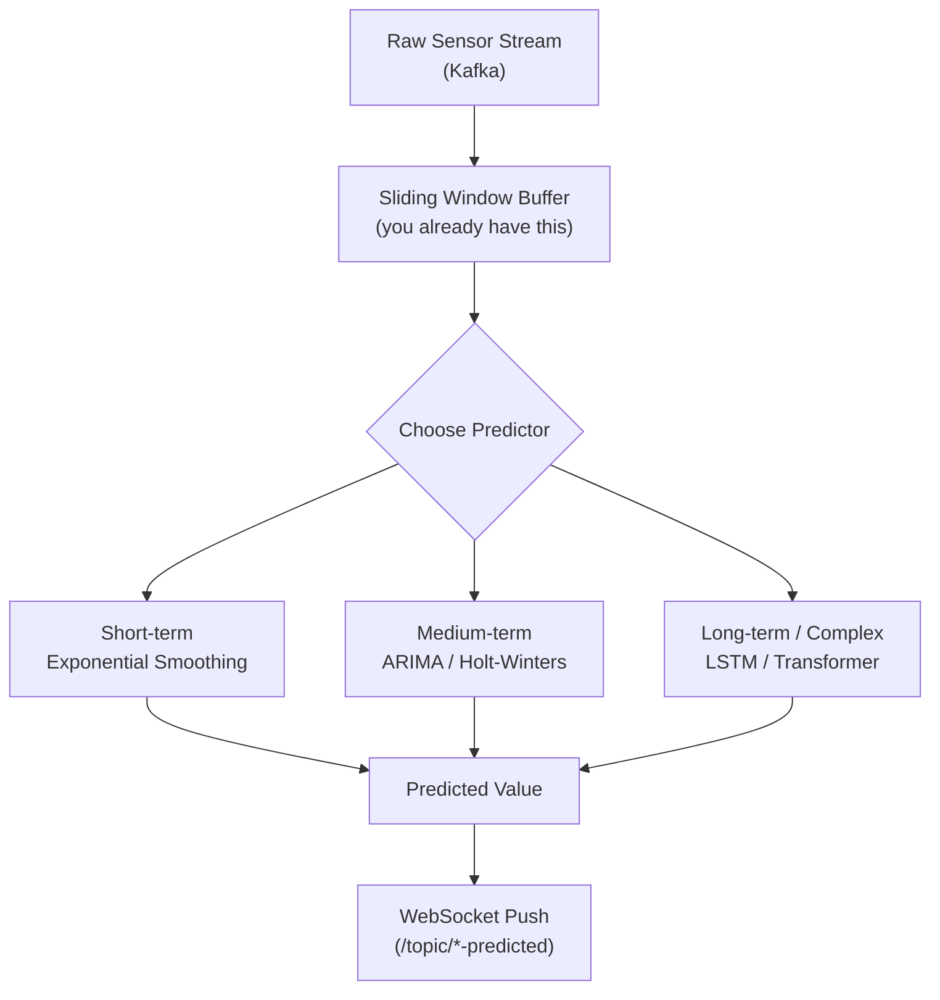
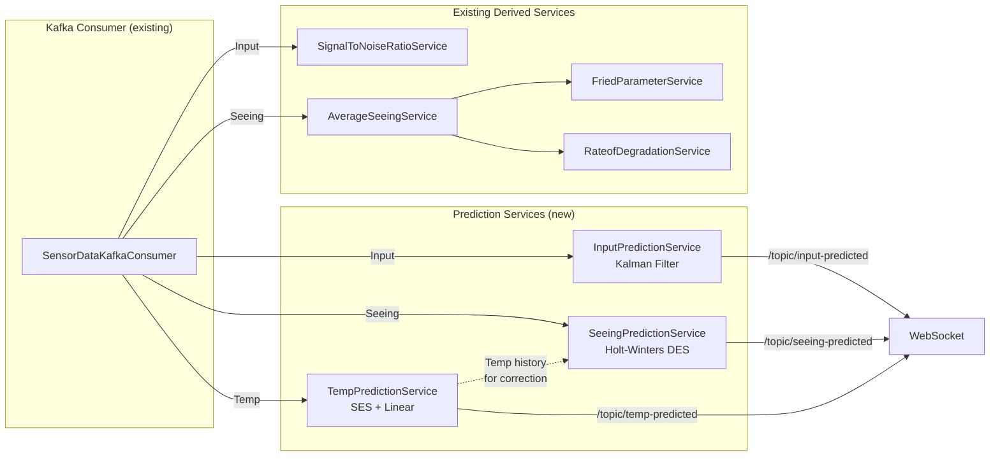

# Predicting Sensor Inputs: Input, Seeing & Temp

## Understanding Your Current Data Pipeline

Your [SensorDataKafkaConsumer](file:///c:/Users/hasun/OneDrive/Documents/GitHub-Portal/aetheris-ai/aetheris-cloud/src/main/java/com/ai/aetheris/application/services/SensorData/SensorDataKafkaConsumer.java) consumes three distinct sensor streams via Kafka:

| Label | Payload Field | Physical Meaning | Current Processing |
|-------|--------------|-------------------|-------------------|
| **`Input`** | `value` (voltage) | Raw telescope voltage signal | SNR computed via sliding window |
| **`Seeing`** | `value` (arcsec) | Atmospheric seeing index | Avg seeing → Fried parameter → Rate of degradation |
| **`Temp`** | `value` (°C/K) | Ambient temperature | **Forwarded raw only — no analysis** |

Each `SensorPayloadDTO` gives you: `label`, `value` (double), and `timestamp` (long). This is a **univariate time series** per label. Prediction means: *given the history of values, forecast the next N values accurately.*

---

## Strategy Overview



---

## 1. Predicting `Input` (Voltage Signal)

### Nature of the Signal
- High-frequency, noisy, oscillatory (it's a raw telescope detector voltage)
- Your [SignalToNoiseRatioService](file:///c:/Users/hasun/OneDrive/Documents/GitHub-Portal/aetheris-ai/aetheris-cloud/src/main/java/com/ai/aetheris/application/services/forcasting/SignalToNoiseRatioService.java) already maintains a sliding window and computes `SNR (dB) = 20 × log₁₀(mean / stddev)`

### Best Prediction Approach: **Exponential Moving Average (EMA) + Kalman Filter**

#### Why?
- Voltage signals are **fast-changing** and **noisy** — you need something that reacts quickly but smooths out noise
- Kalman filter is the gold standard for noisy signal prediction in real-time systems

#### How it works:

**Step 1 — EMA for Trend Extraction:**
```
EMA(t) = α × V(t) + (1 - α) × EMA(t-1)
```
- `α` (smoothing factor) = `2 / (N + 1)` where N = your SNR window size (default 60)
- Higher α → faster reaction, lower α → smoother

**Step 2 — Kalman Filter for Prediction:**

The Kalman filter maintains two values:
- **State estimate** `x̂(t)`: your best guess of the true voltage
- **Error covariance** `P(t)`: how uncertain you are

```
Predict step:
  x̂(t|t-1) = x̂(t-1)       ← assume voltage stays roughly constant
  P(t|t-1)  = P(t-1) + Q    ← Q = process noise (tune this: ~0.01-0.1)

Update step (when new measurement z(t) arrives):
  K(t)      = P(t|t-1) / (P(t|t-1) + R)    ← R = measurement noise (from your SNR!)
  x̂(t)     = x̂(t|t-1) + K(t) × (z(t) - x̂(t|t-1))
  P(t)      = (1 - K(t)) × P(t|t-1)

Prediction for next step:
  x̂(t+1)   = x̂(t)          ← predicted next voltage
```

> [!TIP]
> **Key insight:** You already compute SNR. Use it to set `R` (measurement noise) dynamically:
> - High SNR → low R → trust the measurement more
> - Low SNR → high R → trust the prediction more
> 
> `R = 1 / (10^(SNR_dB / 10))`

**Step 3 — Multi-step Forecast:**

For predicting N steps ahead, propagate the state:
```
x̂(t+k) = x̂(t)  for constant model
```
Or fit a **local linear trend** from the window:
```
slope = LinearRegression over last W samples (you already do this in RateofDegradationService!)
x̂(t+k) = x̂(t) + slope × k
```

#### Accuracy Metrics to Track:
- **MAE** (Mean Absolute Error) = `avg(|predicted - actual|)`
- **MAPE** (Mean Absolute Percentage Error) = `avg(|predicted - actual| / |actual|) × 100`
- Goal: MAPE < 5% for 1-step-ahead on voltage

---

## 2. Predicting `Seeing` (Atmospheric Turbulence)

### Nature of the Signal
- Slowly varying, quasi-periodic (changes with atmospheric conditions)
- Typically ranges from 0.5 to 5.0 arcseconds
- Strong correlation with temperature and time-of-day
- Your [AverageSeeingService](file:///c:/Users/hasun/OneDrive/Documents/GitHub-Portal/aetheris-ai/aetheris-cloud/src/main/java/com/ai/aetheris/application/services/forcasting/AverageSeeingService.java) already smooths it with a sliding window average

### Best Prediction Approach: **Holt-Winters Double Exponential Smoothing**

#### Why?
- Seeing has both a **level** (current baseline) and a **trend** (improving or worsening)
- Double exponential smoothing captures both without the complexity of ARIMA
- Your [RateofDegradationService](file:///c:/Users/hasun/OneDrive/Documents/GitHub-Portal/aetheris-ai/aetheris-cloud/src/main/java/com/ai/aetheris/application/services/forcasting/RateofDegradationService.java) already computes the slope (trend) via linear regression!

#### How it works:

```
Level:     L(t) = α × y(t) + (1 - α) × (L(t-1) + T(t-1))
Trend:     T(t) = β × (L(t) - L(t-1)) + (1 - β) × T(t-1)
Forecast:  ŷ(t+k) = L(t) + k × T(t)
```

Where:
- `α` = level smoothing (0.2 - 0.4 recommended for seeing data)
- `β` = trend smoothing (0.05 - 0.15 recommended — seeing trends change slowly)
- `y(t)` = current average seeing value (from your `AverageSeeingService`)
- `k` = steps ahead to predict

#### Parameter Tuning:

| Parameter | Conservative | Balanced | Reactive |
|-----------|-------------|----------|----------|
| α (level) | 0.1 | 0.3 | 0.5 |
| β (trend) | 0.02 | 0.1 | 0.2 |
| Best for | Stable nights | Normal ops | Rapid weather changes |

> [!IMPORTANT]
> **Cross-correlation with Temperature:** Seeing and temperature are physically correlated (thermal turbulence). For maximum accuracy, use a **multivariate approach**:
> 
> `Seeing_predicted = f(Seeing_history, Temp_history)`
> 
> A simple way: add a correction term `γ × ΔTemp` to your forecast:
> ```
> ŷ(t+k) = L(t) + k × T(t) + γ × (Temp(t) - Temp(t-W))
> ```
> Where `γ` ≈ 0.1–0.3 arcsec/°C (calibrate empirically for your site)

#### Downstream Predictions (Already Computed):

Once you predict seeing, your derived metrics follow automatically:
- **Fried parameter**: `r₀ = 0.98 × λ / (seeing_predicted × ARCSEC_TO_RAD)` — from your [FriedParameterService](file:///c:/Users/hasun/OneDrive/Documents/GitHub-Portal/aetheris-ai/aetheris-cloud/src/main/java/com/ai/aetheris/application/services/forcasting/FriedParameterService.java)
- **Rate of degradation**: slope of predicted seeing values — from your [RateofDegradationService](file:///c:/Users/hasun/OneDrive/Documents/GitHub-Portal/aetheris-ai/aetheris-cloud/src/main/java/com/ai/aetheris/application/services/forcasting/RateofDegradationService.java)

---

## 3. Predicting `Temp` (Temperature)

### Nature of the Signal
- **Very slowly varying** — changes on the order of minutes/hours, not seconds
- **Strong diurnal pattern** (day/night cycle)
- **Highly predictable** — temperature is one of the easiest time-series to forecast
- Currently you just forward it raw with **no analysis at all**

### Best Prediction Approach: **Simple Exponential Smoothing + Trend**

#### Why?
- Temperature is smooth and low-noise — overkill methods add complexity without benefit
- A simple approach gets you 95%+ accuracy easily

#### How it works:

**Option A — SES (Simple Exponential Smoothing)** for short-term (next few minutes):
```
T̂(t+1) = α × T(t) + (1 - α) × T̂(t)

α = 0.1 to 0.3 (temperature is very smooth, so keep α low)
```

**Option B — Linear Extrapolation** for medium-term (next 30–60 min):
```
Collect last N temperature samples (N = 30-60)
Fit a line: T(t) = a + b × t   (linear regression, same as your RateofDegradationService)
Predict: T̂(t+k) = a + b × (t + k)
```

**Option C — Combine both** (recommended):
```
T̂(t+k) = SES(t) + slope × k

Where:
  SES(t)  = exponentially smoothed current temperature
  slope   = linear regression slope over the window
```

> [!TIP]
> Temperature prediction is the simplest of the three. The main challenge is **not accuracy** but **detecting anomalies** — sudden temperature spikes that indicate equipment issues (dome heating, AC failure, etc.). Consider adding an anomaly detector:
> ```
> if |T(t) - T̂(t)| > 3σ → trigger alert
> ```

---

## Comparison Matrix

| Aspect | Input (Voltage) | Seeing (Arcsec) | Temp (°C) |
|--------|----------------|-----------------|-----------|
| **Signal character** | Fast, noisy | Medium, quasi-periodic | Slow, smooth |
| **Recommended method** | Kalman Filter | Holt-Winters DES | SES + Linear trend |
| **α (smoothing)** | Dynamic (from SNR) | 0.2 – 0.4 | 0.1 – 0.3 |
| **Window size** | 60 samples (your current) | 5–30 samples | 30–60 samples |
| **Expected MAPE** | < 5% (1-step) | < 10% (1-step) | < 2% (1-step) |
| **Cross-input help** | No | Yes (from Temp) | No |
| **Complexity** | Medium | Medium-High | Low |

---

## Implementation Architecture (How It Would Fit)



Each prediction service would follow the **same pattern** as your existing services:
- Per-admin `ConcurrentHashMap` for state isolation
- `synchronized` sliding window
- Settings from `SettingsRepository` for window sizes and tuning parameters
- Return `Double.NaN` when insufficient data

---

## Step-by-Step: Making This Highly Accurate

### 1. Data Quality
- **Reject outliers** before feeding into predictors: `if |value - EMA| > 4σ → discard`
- **Handle missing data**: if a gap > expected interval, reset the predictor state
- **Timestamp ordering**: your Kafka consumer doesn't check `timestamp` — out-of-order messages will corrupt predictions

### 2. Adaptive Windowing
- Don't use fixed window sizes — let them adapt:
  - **Calm conditions** → increase window (more history = smoother prediction)
  - **Turbulent conditions** → decrease window (react faster)
  - Use your **Rate of Degradation slope** as the signal: `|slope| > threshold → shrink window`

### 3. Confidence Intervals
- Always emit a prediction **with a confidence band**:
  ```
  {
    "predicted": 2.34,
    "lower_95": 2.12,
    "upper_95": 2.56,
    "confidence": 0.87
  }
  ```
- Confidence = `1 - (prediction_error_std / value_range)`

### 4. Ensemble (Maximum Accuracy)
- Run 2-3 methods in parallel for each sensor
- **Weight their outputs** by recent accuracy:
  ```
  final_prediction = w1 × Kalman + w2 × EMA + w3 × Linear
  
  Update weights every N steps:
    w_i = 1 / MAE_i (inverse of recent error)
    Normalize so w1 + w2 + w3 = 1
  ```

> [!CAUTION]
> **Do NOT use ML/deep learning (LSTM, Transformer) unless** you have:
> - At least 10,000+ historical samples per sensor
> - A separate training pipeline (not real-time)
> - GPU resources for inference
> 
> For real-time telescope sensor data with sliding windows of 5–60 samples, statistical methods (Kalman, Holt-Winters, SES) will **outperform** neural networks in both accuracy and latency.

---

## Quick Reference: Formulas

### Kalman Filter (for Input)
```
Predict:  x̂⁻ = x̂,  P⁻ = P + Q
Update:   K = P⁻/(P⁻+R),  x̂ = x̂⁻ + K(z-x̂⁻),  P = (1-K)P⁻
Use:      R = 1/10^(SNR/10)   ← from your existing SNR service
```

### Holt-Winters DES (for Seeing)
```
L(t) = α·y(t) + (1-α)·(L(t-1) + T(t-1))
T(t) = β·(L(t) - L(t-1)) + (1-β)·T(t-1)
ŷ(t+k) = L(t) + k·T(t) + γ·ΔTemp
```

### SES + Trend (for Temp)
```
S(t) = α·T(t) + (1-α)·S(t-1)
slope = LinReg(last N samples)
T̂(t+k) = S(t) + slope·k
```
