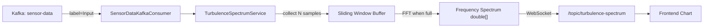

# Turbulence Frequency Spectrum via FFT

## Context

At [SensorDataKafkaConsumer.java:L40](file:///c:/Users/hasun/OneDrive/Documents/GitHub-Portal/aetheris-ai/aetheris-cloud/src/main/java/com/ai/aetheris/application/services/sensorData/SensorDataKafkaConsumer.java#L40), every time a payload with `label == "Input"` arrives, you receive a **single voltage sample** (`double value`). You already accumulate these in a sliding window inside [SignalToNoiseRatioService](file:///c:/Users/hasun/OneDrive/Documents/GitHub-Portal/aetheris-ai/aetheris-cloud/src/main/java/com/ai/aetheris/application/services/forcasting/SignalToNoiseRatioService.java) for SNR computation.

A **Turbulence Frequency Spectrum** applies the same sliding-window idea but runs an FFT on the buffered samples to decompose the turbulence signal into its frequency components — revealing dominant turbulence frequencies, energy distribution, and periodicity.

---

## Architecture Overview



---

## Step 1 — Add Apache Commons Math (FFT library)

> [!TIP]
> Java doesn't have a built-in FFT. Apache Commons Math provides `FastFourierTransformer`.

Add to your `pom.xml`:

```xml
<dependency>
    <groupId>org.apache.commons</groupId>
    <artifactId>commons-math3</artifactId>
    <version>3.6.1</version>
</dependency>
```

---

## Step 2 — Create `TurbulenceSpectrumService`

This service mirrors the pattern used in [SignalToNoiseRatioService](file:///c:/Users/hasun/OneDrive/Documents/GitHub-Portal/aetheris-ai/aetheris-cloud/src/main/java/com/ai/aetheris/application/services/forcasting/SignalToNoiseRatioService.java) — a per-admin sliding window with a configurable size.

```java
package com.ai.aetheris.application.services.forcasting;

import com.ai.aetheris.application.repositories.shared.SettingsRepository;
import lombok.Getter;
import lombok.extern.slf4j.Slf4j;
import org.apache.commons.math3.complex.Complex;
import org.apache.commons.math3.transform.DftNormalization;
import org.apache.commons.math3.transform.FastFourierTransformer;
import org.apache.commons.math3.transform.TransformType;
import org.springframework.stereotype.Service;

import java.util.*;
import java.util.concurrent.ConcurrentHashMap;

@Service
@Slf4j
public class TurbulenceSpectrumService {

    private final SettingsRepository settingsRepository;

    // Per-admin sliding window of voltage samples
    private final Map<UUID, LinkedList<Double>> adminBuffers = new ConcurrentHashMap<>();

    // FFT requires power-of-2 length. Default = 128 samples.
    // You can make this configurable via Settings entity.
    private static final int DEFAULT_FFT_WINDOW = 128;

    @Getter
    private int windowSize = DEFAULT_FFT_WINDOW;

    public TurbulenceSpectrumService(SettingsRepository settingsRepository) {
        this.settingsRepository = settingsRepository;
    }

    private UUID getCurrentAdminId() {
        // Same approach as SignalToNoiseRatioService
        return UUID.fromString("cde46210-35e5-41ad-829e-bab0d171c8f0");
    }

    /**
     * Adds a voltage sample to the buffer. When the buffer reaches
     * the FFT window size, computes and returns the power spectrum.
     *
     * @param voltage the incoming sensor voltage
     * @return a SpectrumResult with frequency bins and magnitudes,
     *         or null if the buffer isn't full yet
     */
    public SpectrumResult addSampleAndCompute(double voltage) {
        UUID adminId = getCurrentAdminId();
        if (adminId == null) {
            return null;
        }

        // Read configured FFT window (must be power of 2)
        int fftWindow = settingsRepository.findByAdminId(adminId)
                .map(s -> nextPowerOf2(s.getSnrWindowSize()))  // reuse or add a dedicated field
                .orElse(DEFAULT_FFT_WINDOW);
        this.windowSize = fftWindow;

        LinkedList<Double> buffer = adminBuffers
                .computeIfAbsent(adminId, k -> new LinkedList<>());

        synchronized (buffer) {
            buffer.addLast(voltage);

            // Keep only the latest fftWindow samples
            while (buffer.size() > fftWindow) {
                buffer.removeFirst();
            }

            // Not enough samples yet
            if (buffer.size() < fftWindow) {
                return null;
            }

            // ---- Perform FFT ----
            return computeSpectrum(buffer, fftWindow);
        }
    }

    private SpectrumResult computeSpectrum(LinkedList<Double> buffer, int n) {
        // 1. Copy to array and subtract mean (remove DC bias)
        double[] samples = new double[n];
        double mean = 0;
        int i = 0;
        for (double v : buffer) {
            samples[i++] = v;
            mean += v;
        }
        mean /= n;
        for (i = 0; i < n; i++) {
            samples[i] -= mean;
        }

        // 2. Apply Hann window to reduce spectral leakage
        for (i = 0; i < n; i++) {
            double hann = 0.5 * (1 - Math.cos(2 * Math.PI * i / (n - 1)));
            samples[i] *= hann;
        }

        // 3. Run FFT
        FastFourierTransformer fft = new FastFourierTransformer(DftNormalization.STANDARD);
        Complex[] fftResult = fft.transform(samples, TransformType.FORWARD);

        // 4. Compute power spectrum (magnitude²) for positive frequencies only
        //    Positive frequencies = indices 0 .. N/2
        int halfN = n / 2;
        double[] magnitudes = new double[halfN + 1];
        double[] frequencies = new double[halfN + 1];

        // Assuming 1 sample per Kafka message at ~1 Hz sampling rate
        // Adjust this to your actual sampling rate
        double samplingRateHz = 1.0;

        for (i = 0; i <= halfN; i++) {
            double re = fftResult[i].getReal();
            double im = fftResult[i].getImaginary();
            magnitudes[i] = (re * re + im * im) / n;  // Power spectral density
            frequencies[i] = i * samplingRateHz / n;   // Frequency bin in Hz
        }

        log.info("Turbulence spectrum computed: {} frequency bins, peak at {} Hz",
                halfN + 1, frequencies[findPeakIndex(magnitudes)]);

        return new SpectrumResult(frequencies, magnitudes);
    }

    private int findPeakIndex(double[] magnitudes) {
        int peakIdx = 1; // skip DC (index 0)
        for (int i = 2; i < magnitudes.length; i++) {
            if (magnitudes[i] > magnitudes[peakIdx]) {
                peakIdx = i;
            }
        }
        return peakIdx;
    }

    private int nextPowerOf2(int value) {
        int p = 1;
        while (p < value) p <<= 1;
        return p;
    }

    /**
     * Result record holding frequency bins and their magnitudes.
     */
    public record SpectrumResult(double[] frequencies, double[] magnitudes) {

        /**
         * Convert to a list of maps for easy JSON serialization over WebSocket.
         */
        public List<Map<String, Object>> toSerializable() {
            List<Map<String, Object>> result = new ArrayList<>();
            for (int i = 0; i < frequencies.length; i++) {
                result.add(Map.of(
                    "frequency", frequencies[i],
                    "power", magnitudes[i]
                ));
            }
            return result;
        }
    }
}
```

> [!IMPORTANT]
> **FFT requires the buffer length to be a power of 2** (e.g., 64, 128, 256, 512). The `nextPowerOf2()` helper ensures this. If you set `snrWindowSize = 100` in settings, the FFT window becomes 128.

---

## Step 3 — Wire into the Kafka Consumer

Inside [SensorDataKafkaConsumer](file:///c:/Users/hasun/OneDrive/Documents/GitHub-Portal/aetheris-ai/aetheris-cloud/src/main/java/com/ai/aetheris/application/services/sensorData/SensorDataKafkaConsumer.java), you would:

1. **Inject** `TurbulenceSpectrumService`
2. **Call it** inside the `if(payload.getLabel().equals("Input"))` block
3. **Send** the spectrum via WebSocket when ready

```java
// --- Add to constructor-injected fields ---
private final TurbulenceSpectrumService turbulenceSpectrumService;

// --- Add inside the "Input" block (after line 68) ---
// Compute turbulence frequency spectrum
TurbulenceSpectrumService.SpectrumResult spectrum =
        turbulenceSpectrumService.addSampleAndCompute(payload.getValue());

if (spectrum != null) {
    log.info("Turbulence spectrum ready — {} bins", spectrum.frequencies().length);
    messagingTemplate.convertAndSend(
            "/topic/turbulence-spectrum",
            spectrum.toSerializable()
    );
}
```

---

## Step 4 — Frontend Consumption

The WebSocket topic `/topic/turbulence-spectrum` will emit JSON like:

```json
[
  { "frequency": 0.0,    "power": 0.0012 },
  { "frequency": 0.0078, "power": 0.0345 },
  { "frequency": 0.0156, "power": 0.1890 },
  ...
]
```

This can be plotted as a **bar chart or line chart** with:
- **X-axis**: Frequency (Hz)
- **Y-axis**: Power Spectral Density

---

## Key Concepts Explained

### Why subtract the mean?
The DC component (index 0 of the FFT) represents the average signal level. For turbulence analysis, you care about **fluctuations** around the mean, not the mean itself. Subtracting it prevents the DC bin from dominating the spectrum.

### Why apply a Hann window?
FFT assumes the input signal is periodic. Since your sliding window chops the signal abruptly, this creates artificial high-frequency artifacts called **spectral leakage**. The Hann window tapers the edges smoothly to zero, minimizing this leakage.

### What does the output tell you?
| Spectrum Pattern | Interpretation |
|---|---|
| **Strong low-frequency peak** | Slow, large-scale turbulence eddies |
| **Energy spread across high frequencies** | Fine-grained, rapid turbulence |
| **Flat spectrum (white noise)** | Random/uncorrelated noise |
| **Power-law decay (Kolmogorov -5/3)** | Classic atmospheric turbulence cascade |

### Sampling rate matters
The code assumes `samplingRateHz = 1.0` (one Kafka message per second). **You must set this to your actual sensor sampling rate** to get correct frequency labels. The maximum detectable frequency (Nyquist) is `samplingRate / 2`.

---

## Summary of Files to Create / Modify

| Action | File | What |
|--------|------|------|
| **Create** | `services/forcasting/TurbulenceSpectrumService.java` | FFT service (Step 2) |
| **Modify** | `pom.xml` | Add commons-math3 dependency (Step 1) |
| **Modify** | `SensorDataKafkaConsumer.java` | Inject + call service (Step 3) |
| **Optionally modify** | `Settings` entity | Add dedicated `fftWindowSize` field |

> [!NOTE]
> This guide follows the same architectural patterns already used in your project — per-admin sliding windows, `@Service` + constructor injection, WebSocket via `SimpMessagingTemplate`, and configurable window sizes from `SettingsRepository`.
